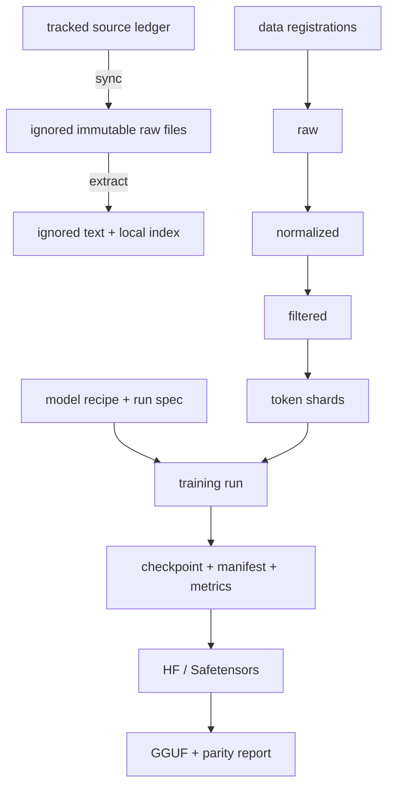

# Architecture

EPOR AI separates immutable evidence and artifacts from rebuildable indexes and
control state. v0.0.1 is deliberately a tiny, CPU-safe proof of the contracts
needed for later training; none of the target-family parameter counts represent
weights present in this repository.

## Model families

All model weights begin from independent random initialization. Teacher models
may provide licensed signals or synthetic data, but their parameters are never
copied, merged, or used as checkpoint initialization.

Families are listed alphabetically, and intended capability descends in the same
order: α is the flagship, γ the compact local model.

| Family                | Planned structure                                                                         | Parameter accounting                                  |                                Context target |
|-----------------------|-------------------------------------------------------------------------------------------|-------------------------------------------------------|----------------------------------------------:|
| EPOR-α (`epor-alpha`) | Shared plus fine-grained routed experts                                                   | ≈30B total; 6–8B active measured per token            |  256K configured; 8K local certification goal |
| EPOR-β (`epor-beta`)  | Dense RMSNorm/SwiGLU/GQA/RoPE decoder with backend-supported local/global attention       | 10–12B total and active                               | 256K configured; 16K local certification goal |
| EPOR-γ (`epor-gamma`) | Elastic dense decoder with nested slices; optional PLE and conditional-memory experiments | ≈8B total, ≈4B core resident path, optional ≈2B slice | 128K configured; 32K local certification goal |

Every recipe keeps these concepts separate:

- `configured_max_context`: the architecture/configuration ceiling.
- `trained_max_context`: the longest sequence length represented in training.
- `validated_max_context`: the longest length that passed the complete context
  evaluation gate.
- `operational_default_context`: a conservative default for a given runtime.
- certified profiles: results measured on an exact hardware/software tuple.

Accepting a tensor of a particular length updates none of the validation fields.

## Reference model

The canonical implementation is pure PyTorch. The v0.0.1 decoder provides
RMSNorm, SwiGLU, grouped-query attention, RoPE, causal masking, tied token
embeddings, deterministic initialization, and FP32 CPU execution. A generated
corpus and debug tokenizer make smoke tests network-free. Transformers is an
interoperability/export boundary, not the canonical training loop.

Target configurations may be constructed on PyTorch's `meta` device for
parameter accounting. Full parameter allocation or training is prohibited
without the compute gates in [COMPUTE_POLICY.md](COMPUTE_POLICY.md).

## Artifact flow

The ledger, registrations, recipes, and manifests are authoritative. SQLite is a rebuildable
query index. Raw research, datasets, run outputs, and weights stay ignored until
an explicit release process creates independently licensed artifacts.

## Provenance-first data engine

`epor.data` implements v0.0.3 as an offline, immutable pipeline under a private
data root. A strict source registration is written before acquisition. Raw files
are copied and hashed incrementally; normalized records retain parent and policy
hashes; rights failures and unsafe findings route to quarantine. Builds apply
removal tombstones and global exact/SimHash deduplication before a salted stable
family hash assigns splits. Filtered indexes, JSONL splits, manifests, and
dataset cards are immutable children rather than mutable views of a corpus.

Detectors retain finding kinds and counts, never the matched PII or credential
value in job events or reports. The rules are explicit proxy-scale heuristics
with human-audit and scale-revalidation requirements, not learned classifier or
malware-sandbox claims. Tokenized shards begin in v0.0.4.

## Research archive safety

The research synchronizer accepts only URLs already present in the validated
catalog. It enforces HTTPS, exact allowlisted hosts, bounded redirects,
content-type and byte limits, transfer-byte hashing, file signatures, atomic
replacement, path containment, and optional offline operation. Immutable
artifacts use raw-byte pins. Explicitly reviewed dynamic HTML sources instead
pin normalized document or semantic-article text under a versioned profile while
recording every raw transfer digest in ignored metadata. The control API keeps
observed raw, tracked raw, and tracked content digests distinct. A digest
observed only during local synchronization is `unpinned`; only a raw or
normalized-content digest in the reviewed tracked ledger can produce `verified`
status.

## Training and scale-out

The single-process loop remains the correctness oracle. Future distributed work
uses composable FSDP2 and distributed checkpointing, with DDP and exact RNG/data
cursor resume tested before scale. Provider-specific CUDA, ROCm, JAX, Triton,
and Hopper stacks live in separate locked environments.

The executable v0.0.1 reference path shares one allocation-free policy across
the CLI and control worker. It rejects non-reference or over-50M recipes before
model construction, caps the in-memory corpus and trusted checkpoint before
loading, and bounds steps, evaluation batches, and batch tokens. Direct CLI
paths additionally remain under `EPOR_PROJECT_ROOT`; target-family recipes are
metadata/meta-device planning inputs and cannot enter this runtime.

The reference RX 5700 XT is an inference target through llama.cpp/Vulkan with a
CPU fallback. It is not a required PyTorch training device.

## Local control plane

The API, worker, and UI are separate processes. Typed job specifications include
the original probe/research/reference-training jobs and v0.0.3's `data_ingest`,
`data_build`, `data_remove`, and `data_audit`. The API never evaluates a client
command, fetches an arbitrary data URL, or exposes a general filesystem browser.

Admission is the covenant chokepoint. `JobService.create_job` resolves the
requested action — still a plain string at that point — against
`configs/covenant-v1.yaml` through `epor.actions` before converting it to a job
type or parsing its specification, records the verdict and covenant hash in the
append-only event stream, and raises rather than queueing anything the covenant
does not permit. The worker re-resolves at dispatch so a job admitted under an
earlier covenant cannot execute under a later one. The CLI shares that registry
rather than keeping its own, through a single command-to-action table, so
`doctor`, `config validate`, `research sync|verify|index`, `data
ingest|build|remove|audit`, `train
pretrain|resume`, `eval run`, and `generate` are governed identically despite
never touching the control plane. They also share the reference-runtime limits
described above, so the declaration's resource assumptions hold on either
route. Stopping work is never gated: the second principle outranks the third,
so cancellation, correction, and shutdown bypass the gate by design.

Identity is part of that resolution rather than a check beside it.
`epor.control.authority` holds one owner and any number of expiring, scoped
delegated operators in a hash-chained log under a private `0700` directory, and
`resolve_action` folds the requesting actor into the second principle's
assessment. An unverified or out-of-scope request therefore becomes a Principle
2 conflict with nothing higher-ranked to justify it, which the existing
ordering refuses — and which no Principle 3 argument about availability can
talk past. Every `GET` remains anonymous. When the covenant escalates instead
of deciding, no job is created and a sanitized escalation is opened carrying
only a digest of the request; an owner approval binds one actor, one digest,
and one covenant hash, expires in fifteen minutes, and is consumed exactly once
under an exclusive file lock. The `principals`, `escalations`, and
`authority_events` tables are a rebuildable index over that log, never a source
of authority.

Jobs use compare-and-set transitions and append-only events. File manifests are
the durable artifact truth; the loopback SQLite database uses WAL mode for local
coordination and can be rebuilt. The server binds to `127.0.0.1`, uses explicit
origins, redacts secrets, and resolves all artifact paths under configured roots.

`/api/v1/documents` serves the project's own tracked Markdown to the console
reader. It is not the filesystem browser the previous paragraph rules out: the
index is built by globbing two fixed first-party locations, and a request is
answered by exact slug lookup inside that index, so no caller-supplied value is
ever joined onto a path. Ignored third-party research downloads are excluded on
purpose — rendering unreviewed external text as console content would make it a
new instruction surface. The reader escapes raw HTML and drops every link scheme
except `http`, `https`, and `mailto`.

## Release boundaries

A release checkpoint consists of sharded Safetensors, configs, tokenizer and
chat format, model card, manifest lineage, data/tokenizer/code hashes, license,
benchmark report, and signed checksums. Quantized derivatives additionally pin
the converter and llama.cpp revisions and report quality drift plus measured
RAM, VRAM, TTFT, and throughput.

See [ROADMAP.md](ROADMAP.md) for gates and
[DATA_GOVERNANCE.md](DATA_GOVERNANCE.md) for rights and lineage policy.
